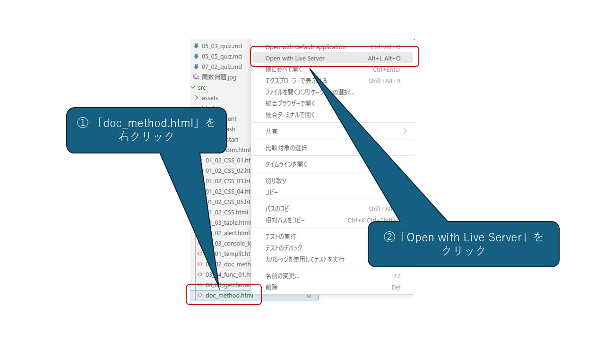

 # Documentオブジェクト 

<ruby>前回<rt>ぜんかい</rt></ruby>、**`window` オブジェクト** はブラウザ<ruby>全体<rt>ぜんたい</rt></ruby>の「<ruby>社長<rt>しゃちょう</rt></ruby>さん」だと<ruby>説明<rt>せつめい</rt></ruby>しましたね。   <ruby>今回<rt>こんかい</rt></ruby>の **`document` オブジェクト** は、`window` オブジェクトの<ruby>下<rt>した</rt></ruby>にあるプロパティで、その<ruby>社長<rt>しゃちょう</rt></ruby>さんの<ruby>下<rt>した</rt></ruby>で<ruby>働<rt>はたら</rt></ruby>く **「<ruby>現場監督<rt>げんばかんとく</rt></ruby>（げんばかんとく）」** です。 

> [!IMPORTANT]
>
> オブジェクトは<ruby>別<rt>べつ</rt></ruby>のオブジェクトのプロパティになることがあります。


<ruby>学生<rt>がくせい</rt></ruby>の<ruby>方<rt>かた</rt></ruby>は、**「ウェブページという<ruby>建物<rt>たてもの</rt></ruby>を<ruby>管理<rt>かんり</rt></ruby>し、<ruby>中身<rt>なかみ</rt></ruby>を<ruby>書<rt>か</rt></ruby>き<ruby>換<rt>か</rt></ruby>えたり、<ruby>新<rt>あたら</rt></ruby>しくパーツを<ruby>作<rt>つく</rt></ruby>ったりする<ruby>責任者<rt>せきにんしゃ</rt></ruby>」** と<ruby>考<rt>かんが</rt></ruby>えると、イメージが<ruby>湧<rt>わ</rt></ruby>きやすくなるかもしれません。 

documentオブジェクトとは、ブラウザに<ruby>表示<rt>ひょうじ</rt></ruby>されている**HTML（ウェブページの<ruby>中身<rt>なかみ</rt></ruby>）** そのものを<ruby>指<rt>さ</rt></ruby>します。  
JavaScriptを<ruby>使<rt>つか</rt></ruby>って、<ruby>文字<rt>もじ</rt></ruby>の<ruby>色<rt>いろ</rt></ruby>を<ruby>変<rt>か</rt></ruby>えたり、ボタンが<ruby>押<rt>お</rt></ruby>されたときに<ruby>動<rt>うご</rt></ruby>きをつけたりするのは、すべてこの「<ruby>現場監督<rt>げんばかんとく</rt></ruby>（document）」に<ruby>命令<rt>めいれい</rt></ruby>を<ruby>出<rt>だ</rt></ruby>しているからです。 

これを<ruby>専門用語<rt>せんもんようご</rt></ruby>で **DOM（ドム / Document Object Model）** と<ruby>呼<rt>よ</rt></ruby>びます。HTMLを「<ruby>木<rt>き</rt></ruby>の<ruby>枝<rt>えだ</rt></ruby>」のような<ruby>構造<rt>こうぞう</rt></ruby>として<ruby>管理<rt>かんり</rt></ruby>しているのが<ruby>特徴<rt>とくちょう</rt></ruby>です。 

DOMツリーについては、<ruby>次<rt>つぎ</rt></ruby>のセクションで、くわしく<ruby>説明<rt>せつめい</rt></ruby>します。ここでは、Windowとdocumentの<ruby>違<rt>ちが</rt></ruby>いをしっかり<ruby>頭<rt>あたま</rt></ruby>に<ruby>入<rt>い</rt></ruby>れてください。 

## 1. documentオブジェクトとは？ 

ブラウザに<ruby>表示<rt>ひょうじ</rt></ruby>されている**HTML（ウェブページの<ruby>中身<rt>なかみ</rt></ruby>）** そのものを<ruby>指<rt>さ</rt></ruby>します。  
JavaScriptを<ruby>使<rt>つか</rt></ruby>って、<ruby>文字<rt>もじ</rt></ruby>の<ruby>色<rt>いろ</rt></ruby>を<ruby>変<rt>か</rt></ruby>えたり、ボタンが<ruby>押<rt>お</rt></ruby>されたときに<ruby>動<rt>うご</rt></ruby>きをつけたりするのは、すべてこの「<ruby>現場監督<rt>げんばかんとく</rt></ruby>（document）」に<ruby>命令<rt>めいれい</rt></ruby>を<ruby>出<rt>だ</rt></ruby>しているからです。 

これを<ruby>専門用語<rt>せんもんようご</rt></ruby>で **DOM（ドム / Document Object Model）** と<ruby>呼<rt>よ</rt></ruby>びます。HTMLを「<ruby>木<rt>き</rt></ruby>の<ruby>枝<rt>えだ</rt></ruby>」のような<ruby>構造<rt>こうぞう</rt></ruby>として<ruby>管理<rt>かんり</rt></ruby>しているのが<ruby>特徴<rt>とくちょう</rt></ruby>です。 

***


## 2. よく<ruby>使<rt>つか</rt></ruby>うプロパティ（ページの<ruby>情報<rt>じょうほう</rt></ruby>） 

<ruby>現場監督<rt>げんばかんとく</rt></ruby>が<ruby>知<rt>し</rt></ruby>っている、<ruby>今<rt>いま</rt></ruby>のページの<ruby>情報<rt>じょうほう</rt></ruby>です。 

* **`document.title`**  
  ブラウザのタブに<ruby>表示<rt>ひょうじ</rt></ruby>されている「ページのタイトル」です。JavaScriptで<ruby>書<rt>か</rt></ruby>き<ruby>換<rt>か</rt></ruby>えることもできます。
* **`document.body`**  
  HTMLの `<body>` タグの<ruby>中身全体<rt>なかみぜんたい</rt></ruby>です。ページ<ruby>全体<rt>ぜんたい</rt></ruby>の<ruby>背景色<rt>はいけいしょく</rt></ruby>を<ruby>変<rt>か</rt></ruby>えたいときなどに<ruby>使<rt>つか</rt></ruby>います。
* **`document.URL`**   <ruby>現在開<rt>げんざいひら</rt></ruby>いているページの<ruby>住所<rt>じゅうしょ</rt></ruby>（URL）を<ruby>教<rt>おし</rt></ruby>えてくれます。 

***


## 3. よく<ruby>使<rt>つか</rt></ruby>うメソッド（<ruby>現場監督<rt>げんばかんとく</rt></ruby>への<ruby>命令<rt>めいれい</rt></ruby>） 

これが<ruby>一番大切<rt>いちばんたいせつ</rt></ruby>です！ <ruby>特定<rt>とくてい</rt></ruby>の<ruby>場所<rt>ばしょ</rt></ruby>を<ruby>探<rt>さが</rt></ruby>したり、<ruby>中身<rt>なかみ</rt></ruby>を<ruby>変<rt>か</rt></ruby>えたりする<ruby>命令<rt>めいれい</rt></ruby>です。 

### **<ruby>場所<rt>ばしょ</rt></ruby>を<ruby>探<rt>さが</rt></ruby>す（セレクタ）** 

* **`getElementById("ID名")`**   <ruby>特定<rt>とくてい</rt></ruby>のIDがついたパーツを1つだけ<ruby>探<rt>さが</rt></ruby>します。<ruby>一番速<rt>いちばんはや</rt></ruby>くて<ruby>正確<rt>せいかく</rt></ruby>です。
* **`querySelector("セレクタ")`**  
  CSSと<ruby>同<rt>おな</rt></ruby>じ<ruby>書<rt>か</rt></ruby>き<ruby>方<rt>かた</rt></ruby>（`.class` や `#id`）でパーツを<ruby>探<rt>さが</rt></ruby>せます。とても<ruby>便利<rt>べんり</rt></ruby>です！ 

これらは、<ruby>以前<rt>いぜん</rt></ruby>にも<ruby>出<rt>で</rt></ruby>てきましたね。<ruby>実<rt>じつ</rt></ruby>はdocumentオブジェクトのメソッドだったのです！ 

> [!note]
>
> `document.getElementById("ID名")`のように<ruby>書<rt>か</rt></ruby>いてもかまいませんが、<ruby>普通<rt>ふつう</rt></ruby>は`document.`を<ruby>省略<rt>しょうりゃく</rt></ruby>して、`getElementById("ID名")`と<ruby>書<rt>か</rt></ruby>きます。 


### **<ruby>中身<rt>なかみ</rt></ruby>を<ruby>書<rt>か</rt></ruby>き<ruby>換<rt>か</rt></ruby>える・<ruby>作<rt>つく</rt></ruby>る** 

* **`createElement("タグ名")`**   <ruby>新<rt>あたら</rt></ruby>しいパーツ（`<div>` や `<li>` など）をメモリの<ruby>中<rt>なか</rt></ruby>に<ruby>作<rt>つく</rt></ruby>ります。
* **`write("文字")`**  
  ページに<ruby>直接文字<rt>ちょくせつもじ</rt></ruby>を<ruby>書<rt>か</rt></ruby>き<ruby>込<rt>こ</rt></ruby>みます（※あまり<ruby>使<rt>つか</rt></ruby>いませんが、<ruby>基本<rt>きほん</rt></ruby>として<ruby>覚<rt>おぼ</rt></ruby>えておきましょう）。


***


## 4. <ruby>実際<rt>じっさい</rt></ruby>に<ruby>動<rt>うご</rt></ruby>かしてみよう！ 

Visual Studio Code を<ruby>使<rt>つか</rt></ruby>って、<ruby>以下<rt>いか</rt></ruby>のようなhtmlを<ruby>作成<rt>さくせい</rt></ruby>しましょう。<ruby>名前<rt>なまえ</rt></ruby>は`doc_obj.html`としましょうか。 

```html
<!DOCTYPE html>
<html lang="ja">
    <head>
        <meta charset="UTF-8">
        <meta name="viewport" content="width=device-width, initial-scale=1.0">
        <title>Document</title>
    </head>
    <body>
        <h1 id="greeting">こんにちは！</h1>
        
        <p>コンソールを開いて、下のJavaScriptを入力してみましょう。</p>
        
        <pre>
            // 1. IDが "greeting" というパーツを探す
            const message = document.getElementById("greeting");
            // 2. その中身を書き換える
            message.textContent = "こんにちは、日本へようこそ！";
            // 3. スタイル（色）も変えちゃう
            message.style.color = "red";
        </pre>
        
        <a href="javascript:history.back();">戻る</a>
    </body>
</html>
```


<ruby>保存<rt>ほぞん</rt></ruby>できたら、Visual Studio Code <ruby>上<rt>じょう</rt></ruby>から、`Open with Live Sever`を<ruby>使<rt>つか</rt></ruby>って、<ruby>開<rt>ひら</rt></ruby>きましょう。 




ブラウザに<ruby>表示<rt>ひょうじ</rt></ruby>された<ruby>指示<rt>しじ</rt></ruby>に<ruby>従<rt>したが</rt></ruby>って、コンソールにJavaScriptを<ruby>入力<rt>にゅうりょく</rt></ruby>しましょう。 

> コンソールを<ruby>開<rt>ひら</rt></ruby>くには、F12 キー（ノートPCは Fn + F12） または Ctrl + Shift + I を<ruby>使<rt>つか</rt></ruby>います。


**オブジェクトと const の<ruby>意外<rt>いがい</rt></ruby>な<ruby>関係<rt>かんけい</rt></ruby>** 

<ruby>上<rt>うえ</rt></ruby>のコードを<ruby>見<rt>み</rt></ruby>て、<ruby>疑問<rt>ぎもん</rt></ruby>に<ruby>思<rt>おも</rt></ruby>いませんでしたか？「`const` で<ruby>宣言<rt>せんげん</rt></ruby>された<ruby>変数<rt>へんすう</rt></ruby>は、<ruby>後<rt>あと</rt></ruby>から<ruby>値<rt>あたい</rt></ruby>を<ruby>変更<rt>へんこう</rt></ruby>できないはずでは？」そう<ruby>思<rt>おも</rt></ruby>った<ruby>人<rt>ひと</rt></ruby>は、<ruby>変数<rt>へんすう</rt></ruby>の<ruby>説明<rt>せつめい</rt></ruby>をとてもよく<ruby>覚<rt>おぼ</rt></ruby>えている<ruby>人<rt>ひと</rt></ruby>です。 

しかし、<ruby>上<rt>うえ</rt></ruby>のコードはエラーになりません。それについて、<ruby>説明<rt>せつめい</rt></ruby>しましょう。 

JavaScriptの<ruby>初心者<rt>しょしんしゃ</rt></ruby>が<ruby>混乱<rt>こんらん</rt></ruby>しやすい<ruby>点<rt>てん</rt></ruby>のひとつが、オブジェクトと `const` の<ruby>意外<rt>いがい</rt></ruby>な<ruby>関係<rt>かんけい</rt></ruby>です。 

「 `const` で<ruby>宣言<rt>せんげん</rt></ruby>した<ruby>変数<rt>へんすう</rt></ruby>は<ruby>中身<rt>なかみ</rt></ruby>を<ruby>変<rt>か</rt></ruby>えられない」と<ruby>説明<rt>せつめい</rt></ruby>しましたが、オブジェクトの<ruby>場合<rt>ばあい</rt></ruby>は<ruby>少<rt>すこ</rt></ruby>し<ruby>違<rt>ちが</rt></ruby>います。 

* <ruby>名札<rt>なふだ</rt></ruby>の<ruby>固定<rt>こてい</rt></ruby>（<ruby>参照<rt>さんしょう</rt></ruby>の<ruby>不変性<rt>ふへんせい</rt></ruby>）：const で<ruby>作<rt>つく</rt></ruby>ったオブジェクトそのものを<ruby>別<rt>べつ</rt></ruby>のオブジェクトに<ruby>入<rt>い</rt></ruby>れ<ruby>替<rt>か</rt></ruby>ることはできません（<ruby>別<rt>べつ</rt></ruby>の<ruby>箱<rt>はこ</rt></ruby>に<ruby>名札<rt>なふだ</rt></ruby>を<ruby>付<rt>つ</rt></ruby>け<ruby>替<rt>か</rt></ruby>えるのは<ruby>禁止<rt>きんし</rt></ruby>）。
* <ruby>中身<rt>なかみ</rt></ruby>の<ruby>変更<rt>へんこう</rt></ruby>はOK：<ruby>箱<rt>はこ</rt></ruby>の<ruby>中<rt>なか</rt></ruby>に<ruby>入<rt>はい</rt></ruby>っている<ruby>個別<rt>こべつ</rt></ruby>のデータ（プロパティ）を<ruby>書<rt>か</rt></ruby>き<ruby>換<rt>か</rt></ruby>えることは<ruby>可能<rt>かのう</rt></ruby>です。 

「<ruby>強力<rt>きょうりょく</rt></ruby>なガムテープで<ruby>名札<rt>なふだ</rt></ruby>が<ruby>貼<rt>は</rt></ruby>られた<ruby>箱<rt>はこ</rt></ruby>」をイメージしてください。ガムテープで<ruby>固定<rt>こてい</rt></ruby>されているので、<ruby>名札<rt>なふだ</rt></ruby>を<ruby>別<rt>べつ</rt></ruby>の<ruby>新<rt>あたら</rt></ruby>しい<ruby>箱<rt>はこ</rt></ruby>に<ruby>貼<rt>は</rt></ruby>り<ruby>直<rt>なお</rt></ruby>すことはできません。でも、<ruby>箱<rt>はこ</rt></ruby>のふたをひとつ<ruby>開<rt>あ</rt></ruby>けて、<ruby>中<rt>なか</rt></ruby>に<ruby>入<rt>はい</rt></ruby>っているお<ruby>菓子<rt>かし</rt></ruby>を<ruby>入<rt>い</rt></ruby>れ<ruby>替<rt>か</rt></ruby>えたり、ジャムを<ruby>塗<rt>ぬ</rt></ruby>ったりすることは<ruby>自由<rt>じゆう</rt></ruby>なのです。 

<ruby>例<rt>たと</rt></ruby>えるなら、「ファイルの<ruby>保存場所<rt>ほぞんばしょ</rt></ruby>（パス）」は<ruby>固定<rt>こてい</rt></ruby>されているけれど、「ファイルの<ruby>中身<rt>なかみ</rt></ruby>」は<ruby>自由<rt>じゆう</rt></ruby>に<ruby>書<rt>か</rt></ruby>き<ruby>換<rt>か</rt></ruby>えられるようなイメージです。 

<ruby>先<rt>さき</rt></ruby>ほどの<ruby>例<rt>れい</rt></ruby>では、`const`を<ruby>使<rt>つか</rt></ruby>って<ruby>宣言<rt>せんげん</rt></ruby>した`message`という<ruby>箱<rt>はこ</rt></ruby>を<ruby>開<rt>あ</rt></ruby>けて、<ruby>中身<rt>なかみ</rt></ruby>を"こんにちは、<ruby>日本<rt>にほん</rt></ruby>へようこそ！"に<ruby>入<rt>い</rt></ruby>れ<ruby>替<rt>か</rt></ruby>えました。これはエラーにはなりません。 

しかし、 

```javascript
// 1. IDが "greeting" というパーツを探す
const message = document.getElementById("greeting");
// 2. タグがpのパーツを探す
message = document.querySelector("p")
```


はエラーになります。`message` というラベルを「"greeting"というIDの<ruby>箱<rt>はこ</rt></ruby>」からはがして、「"p"というタグの<ruby>別<rt>べつ</rt></ruby>の<ruby>箱<rt>はこ</rt></ruby>」に<ruby>貼<rt>は</rt></ruby>ろうとしているからです。 

`const` は `message` というラベルと、それを<ruby>入<rt>い</rt></ruby>れる<ruby>入<rt>い</rt></ruby>れ<ruby>物<rt>もの</rt></ruby>との<ruby>関係<rt>かんけい</rt></ruby>を<ruby>固定<rt>こてい</rt></ruby>して、ラベルの<ruby>張替<rt>はりか</rt></ruby>えを<ruby>許<rt>ゆる</rt></ruby>しません。 

しかし、あくまで **ラベルと<ruby>入<rt>い</rt></ruby>れ<ruby>物<rt>もの</rt></ruby>との<ruby>関係<rt>かんけい</rt></ruby>** であって、 **<ruby>入<rt>い</rt></ruby>れ<ruby>物<rt>もの</rt></ruby>が<ruby>同<rt>おな</rt></ruby>じであれば、その<ruby>中身<rt>なかみ</rt></ruby>が<ruby>変<rt>か</rt></ruby>わっても、かまわない** のです。 

***


## 5. <ruby>学生<rt>がくせい</rt></ruby>へのアドバイス：`window` と `document` の<ruby>使<rt>つか</rt></ruby>い<ruby>分<rt>わ</rt></ruby>け 

「どっちを<ruby>使<rt>つか</rt></ruby>えばいいの？」と<ruby>聞<rt>き</rt></ruby>かれたら、こう<ruby>答<rt>こた</rt></ruby>えてあげてください。 

> **「ブラウザの<ruby>機能<rt>きのう</rt></ruby>（タイマー、アラート、URL<ruby>移動<rt>いどう</rt></ruby>）を<ruby>使<rt>つか</rt></ruby>いたいときは `window`」**
>
> **「ページの<ruby>中身<rt>なかみ</rt></ruby>（<ruby>文字<rt>もじ</rt></ruby>、<ruby>画像<rt>がぞう</rt></ruby>、ボタン）をいじりたいときは `document`」**


***


## まとめテーブル 

| <ruby>命令<rt>めいれい</rt></ruby>・<ruby>情報<rt>じょうほう</rt></ruby>の<ruby>名前<rt>なまえ</rt></ruby> | <ruby>役割<rt>やくわり</rt></ruby>                                                       | <ruby>例<rt>たと</rt></ruby>え<ruby>話<rt>ばなし</rt></ruby>                                                                                   |
| -------------------------------------------------------------------------------------- | ---------------------------------------------------------------------------------- | -------------------------------------------------------------------------------------------------------------------------------------- |
| **`title`**                                  | ページのタイトル                                                                           | <ruby>本<rt>ほん</rt></ruby>の<ruby>表紙<rt>ひょうし</rt></ruby>の<ruby>名前<rt>なまえ</rt></ruby>                                                     |
| **`getElementById()`**                       | <ruby>特定<rt>とくてい</rt></ruby>のパーツを<ruby>指名<rt>しめい</rt></ruby>する                     | 「<ruby>出席番号<rt>しゅっせきばんごう</rt></ruby>○<ruby>番<rt>ばん</rt></ruby>の<ruby>人<rt>ひと</rt></ruby>！」と<ruby>呼<rt>よ</rt></ruby>ぶ                   |
| **`querySelector()`**                        | <ruby>自由<rt>じゆう</rt></ruby>にパーツを<ruby>探<rt>さが</rt></ruby>す                         | 「<ruby>赤<rt>あか</rt></ruby>い<ruby>服<rt>ふく</rt></ruby>を<ruby>着<rt>き</rt></ruby>ている<ruby>人<rt>ひと</rt></ruby>！」と<ruby>探<rt>さが</rt></ruby>す |
| **`textContent`**                            | <ruby>文字<rt>もじ</rt></ruby>を<ruby>書<rt>か</rt></ruby>き<ruby>換<rt>か</rt></ruby>える     | <ruby>看板<rt>かんばん</rt></ruby>の<ruby>文字<rt>もじ</rt></ruby>を<ruby>書<rt>か</rt></ruby>き<ruby>直<rt>なお</rt></ruby>す                            |
| **`createElement()`**                        | <ruby>新<rt>あたら</rt></ruby>しい<ruby>要素<rt>ようそ</rt></ruby>を<ruby>作<rt>つく</rt></ruby>る | <ruby>新<rt>あたら</rt></ruby>しいレンガを<ruby>用意<rt>ようい</rt></ruby>する                                                                          |


***


いかがでしょうか？「<ruby>現場監督<rt>げんばかんとく</rt></ruby>の document くん」がいれば、ウェブページを<ruby>思<rt>おも</rt></ruby>った<ruby>通<rt>とお</rt></ruby>りに<ruby>操<rt>あやつ</rt></ruby>れるようになります。 

