# ウェブ<ruby>開発<rt>かいはつ</rt></ruby>のためのファイルとフォルダの<ruby>基本<rt>きほん</rt></ruby>ガイド

ウェブサイトを<ruby>作<rt>つく</rt></ruby>るとき、たくさんのファイルを<ruby>使<rt>つか</rt></ruby>います。このガイドでは、プロのエンジニアが<ruby>最初<rt>さいしょ</rt></ruby>に<ruby>覚<rt>おぼ</rt></ruby>える「ファイルの<ruby>整理<rt>せいり</rt></ruby>・<ruby>整頓<rt>せいとん</rt></ruby>」のルールを、やさしく<ruby>説明<rt>せつめい</rt></ruby>します。

***

## 1. はじめに：なぜファイルの<ruby>整理<rt>せいり</rt></ruby>が<ruby>大切<rt>たいせつ</rt></ruby>なのか

ウェブサイトは、<ruby>文字<rt>もじ</rt></ruby>のデータ、プログラム、<ruby>画像<rt>がぞう</rt></ruby>など、<ruby>多<rt>おお</rt></ruby>くのファイルで<ruby>構成<rt>こうせい</rt></ruby>されています。これらのファイルは、お<ruby>互<rt>たが</rt></ruby>いに<ruby>呼<rt>よ</rt></ruby>び<ruby>出<rt>だ</rt></ruby>し<ruby>合<rt>あ</rt></ruby>って<ruby>動<rt>うご</rt></ruby>いています。

もしファイルがバラバラな<ruby>場所<rt>ばしょ</rt></ruby>にあると、ウェブサイトは<ruby>正<rt>ただ</rt></ruby>しく<ruby>動<rt>うご</rt></ruby>きません。<ruby>最初<rt>さいしょ</rt></ruby>にしっかり<ruby>整理<rt>せいり</rt></ruby>するルールを<ruby>決<rt>き</rt></ruby>めることが、ウェブサイト<ruby>作<rt>づく</rt></ruby>りを<ruby>成功<rt>せいこう</rt></ruby>させる<ruby>一番<rt>いちばん</rt></ruby>の<ruby>近道<rt>ちかみち</rt></ruby>です。

<ruby>次<rt>つぎ</rt></ruby>は、<ruby>自分<rt>じぶん</rt></ruby>のパソコンのどこにファイルを<ruby>作<rt>つく</rt></ruby>るべきか<ruby>説明<rt>せつめい</rt></ruby>します。

***

## 2. ウェブサイトの<ruby>場所<rt>ばしょ</rt></ruby>を<ruby>決<rt>き</rt></ruby>めよう

ウェブサイトのファイルは、<ruby>一<rt>ひと</rt></ruby>つのフォルダにまとめて<ruby>入<rt>い</rt></ruby>れます。このフォルダの<ruby>中身<rt>なかみ</rt></ruby>は、インターネット<ruby>上<rt>じょう</rt></ruby>のコンピュータ（サーバー）に<ruby>公開<rt>こうかい</rt></ruby>するときと「<ruby>同<rt>おな</rt></ruby>じ<ruby>形<rt>かたち</rt></ruby>」にする<ruby>必要<rt>ひつよう</rt></ruby>があります。これを「ミラー（<ruby>鏡<rt>かがみ</rt></ruby>）」と<ruby>呼<rt>よ</rt></ruby>びます。<ruby>自分<rt>じぶん</rt></ruby>のパソコンで<ruby>動<rt>うご</rt></ruby>くものは、サーバーでも<ruby>同<rt>おな</rt></ruby>じように<ruby>動<rt>うご</rt></ruby>かなければいけないからです。

**おすすめのフォルダ<ruby>階層<rt>かいそう</rt></ruby>**

MDN（ウェブ<ruby>開発<rt>かいはつ</rt></ruby>の<ruby>標準<rt>ひょうじゅん</rt></ruby>的な<ruby>資料<rt>しりょう</rt></ruby>）では、<ruby>次<rt>つぎ</rt></ruby>のような<ruby>作<rt>つく</rt></ruby>り<ruby>方<rt>かた</rt></ruby>をすすめています。

### (1). まず、すべてのプロジェクトを<ruby>保存<rt>ほぞん</rt></ruby>する web-projects というフォルダを<ruby>作<rt>つく</rt></ruby>ります。

<ruby>今回<rt>こんかい</rt></ruby>は、PC > ローカルディスク(C:) > ユーザー > student1 > source の<ruby>下<rt>した</rt></ruby>につくりましょう。

1. ステータスバーの<ruby>検索窓<rt>けんさくまど</rt></ruby>に「エクスプローラー」と<ruby>入力<rt>にゅうりょく</rt></ruby>します。
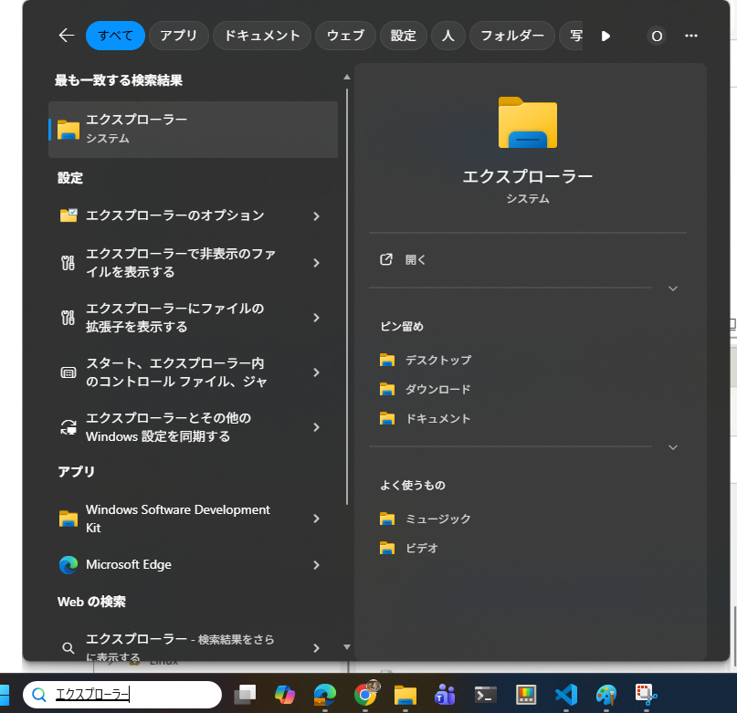

1. <ruby>左<rt>ひだり</rt></ruby>の「PC」の<ruby>下<rt>した</rt></ruby>の「ローカルディスク(C:)」をクリックします。
1. <ruby>右<rt>みぎ</rt></ruby>の「ユーザー」をダブル クリックして、<ruby>開<rt>ひら</rt></ruby>きます。
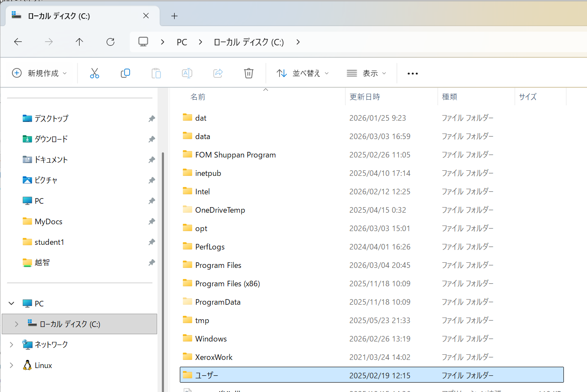

1. 「student1」をダブル クリックして、<ruby>開<rt>ひら</rt></ruby>きます。
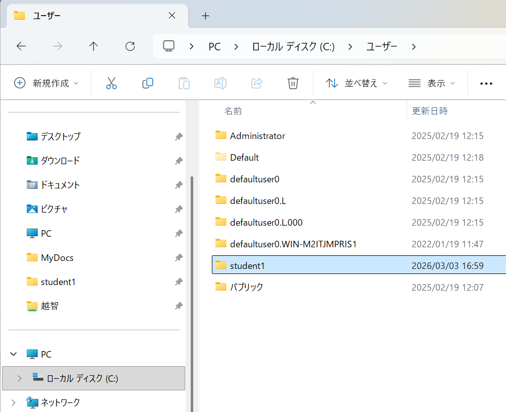

1. 「source」をダブル クリックして<ruby>開<rt>ひら</rt></ruby>きます。
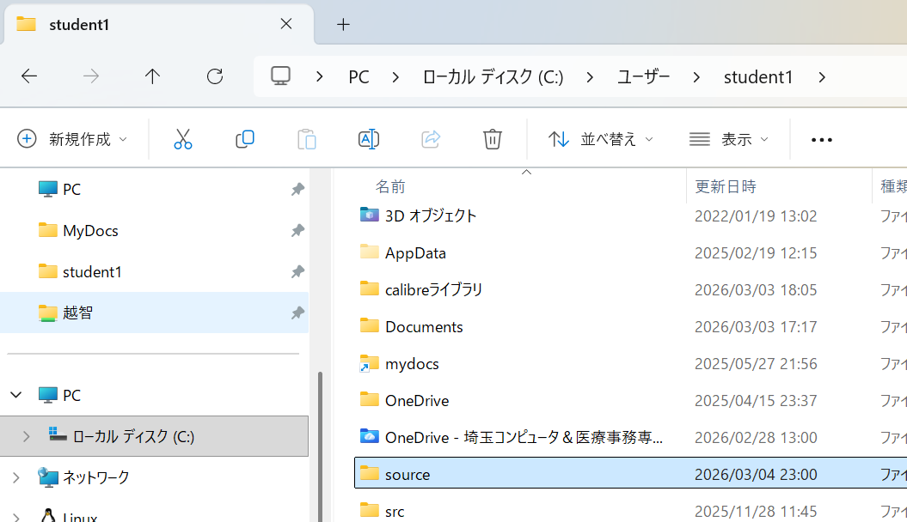

1. <ruby>右<rt>みぎ</rt></ruby>クリックして、「<ruby>新規<rt>しんき</rt></ruby><ruby>作成<rt>さくせい</rt></ruby>」 →　「フォルダー」 をクリックします。
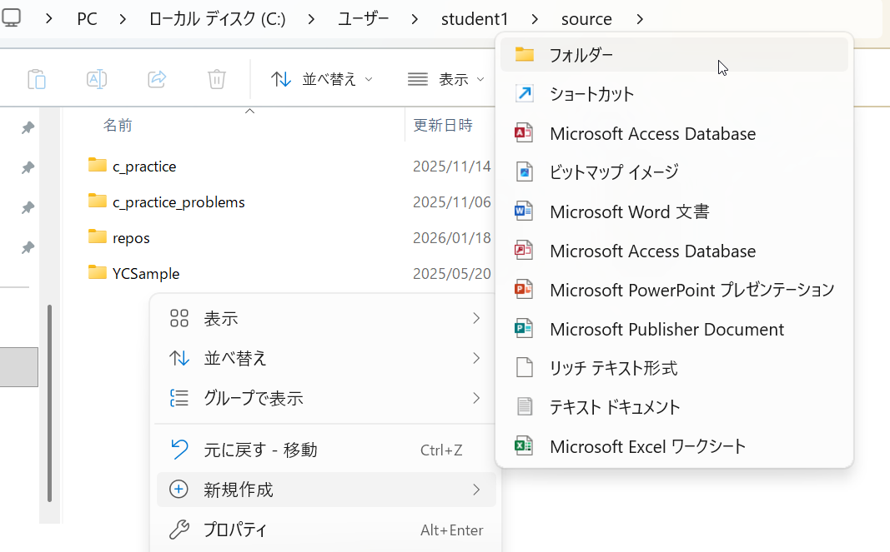

1. 「<ruby>新<rt>あたら</rt></ruby>しいフォルダー」を「web-projects」に<ruby>書<rt>か</rt></ruby>き<ruby>換<rt>か</rt></ruby>えます。
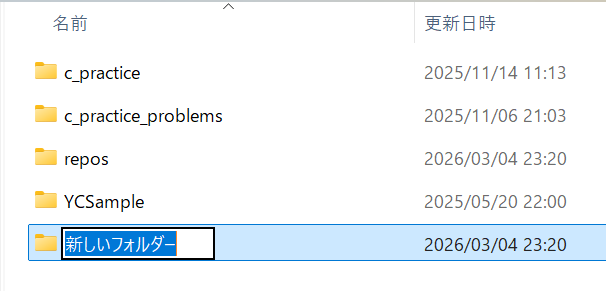
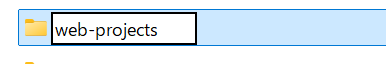

### (2). すぐに<ruby>見<rt>み</rt></ruby>つけられるように、クイックアクセスにピン<ruby>留<rt>ど</rt></ruby>めしましょう。

1. 「web-projects」を<ruby>一度<rt>いちど</rt></ruby>クリックしてから、<ruby>右<rt>みぎ</rt></ruby>クリックします。
1. 「クイック アクセスにピン<ruby>留<rt>ど</rt></ruby>めする」をクリックします。
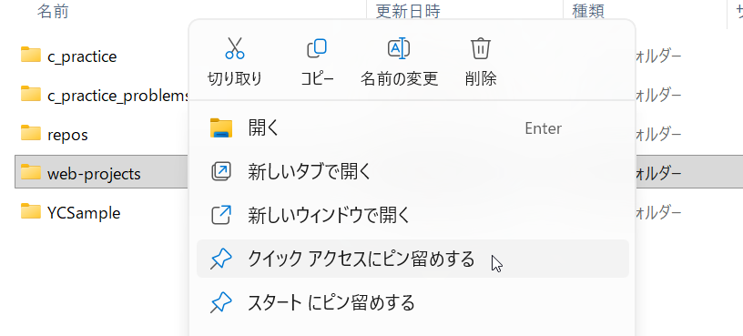

1. <ruby>右<rt>みぎ</rt></ruby>のクイック アクセスに「web-projects」が<ruby>表示<rt>ひょうじ</rt></ruby>されるのを<ruby>確認<rt>かくにん</rt></ruby>します。
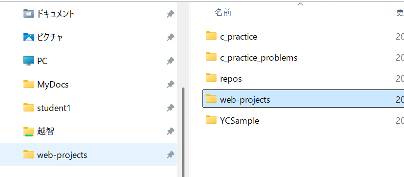

### (3). 「web-projects」の<ruby>中<rt>なか</rt></ruby>に<ruby>個別<rt>こべつ</rt></ruby>のサイト用のフォルダを<ruby>作<rt>つく</rt></ruby>ります。

1. 5.6.と<ruby>同<rt>おな</rt></ruby>じ<ruby>手順<rt>てじゅん</rt></ruby>で、「test-site」というフォルダを<ruby>作<rt>つく</rt></ruby>ります。これが<ruby>今回<rt>こんかい</rt></ruby>の<ruby>個別<rt>こべつ</rt></ruby>のサイト用のフォルダになります。
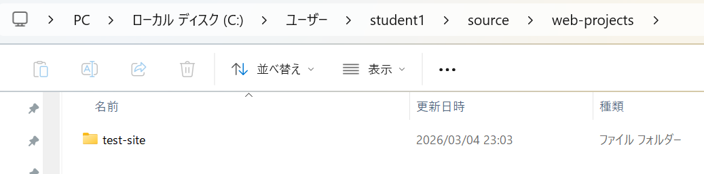

<ruby>場所<rt>ばしょ</rt></ruby>は、デスクトップやホームフォルダなど、<ruby>自分<rt>じぶん</rt></ruby>ですぐに<ruby>見<rt>み</rt></ruby>つけられる<ruby>場所<rt>ばしょ</rt></ruby>にしてください。<ruby>場所<rt>ばしょ</rt></ruby>が<ruby>決<rt>き</rt></ruby>まっていると、<ruby>作業<rt>さぎょう</rt></ruby>のミスが<ruby>減<rt>へ</rt></ruby>り、<ruby>開発<rt>かいはつ</rt></ruby>のスピードが<ruby>速<rt>はや</rt></ruby>くなります。

<ruby>次<rt>つぎ</rt></ruby>は、ファイルの<ruby>名前<rt>なまえ</rt></ruby>の<ruby>付<rt>つ</rt></ruby>け<ruby>方<rt>かた</rt></ruby>を<ruby>説明<rt>せつめい</rt></ruby>します。

***

## 3. ファイル<ruby>名<rt>めい</rt></ruby>とフォルダ<ruby>名<rt>めい</rt></ruby>の<ruby>絶対<rt>ぜったい</rt></ruby>ルール

<ruby>名前<rt>なまえ</rt></ruby>を<ruby>付<rt>つ</rt></ruby>けるときは、<ruby>世界中<rt>せかいじゅう</rt></ruby>のエンジニアが<ruby>守<rt>まも</rt></ruby>っている「3つのルール」があります。

1. すべて<ruby>小文字<rt>こもじ</rt></ruby>にする  
   <ruby>多<rt>おお</rt></ruby>くのサーバー（Linuxなど）は、<ruby>大文字<rt>おおもじ</rt></ruby>と<ruby>小文字<rt>こもじ</rt></ruby>を<ruby>厳<rt>きび</rt></ruby>しく<ruby>区別<rt>くべつ</rt></ruby>します。MyImage.jpg と myimage.jpg は<ruby>別<rt>べつ</rt></ruby>のファイルだと<ruby>判断<rt>はんだん</rt></ruby>されるため、<ruby>大文字<rt>おおもじ</rt></ruby>を<ruby>使<rt>つか</rt></ruby>うとエラーの<ruby>原因<rt>げんいん</rt></ruby>になります。
2. <ruby>空白<rt>くうはく</rt></ruby>（スペース）を<ruby>入<rt>い</rt></ruby>れない  
   コマンドライン（<ruby>文字<rt>もじ</rt></ruby>で<ruby>命令<rt>めいれい</rt></ruby>するツール）を<ruby>使<rt>つか</rt></ruby>うとき、スペースがあるとコンピュータは「2つの<ruby>別<rt>べつ</rt></ruby>のファイル」だと<ruby>勘違<rt>かんちが</rt></ruby>いしてしまいます。
3. <ruby>言葉<rt>ことば</rt></ruby>を<ruby>分<rt>わ</rt></ruby>けるときはハイフン「-」を<ruby>使<rt>つか</rt></ruby>う  
   アンダースコア「_」も<ruby>使<rt>つか</rt></ruby>えますが、ハイフンの<ruby>方<rt>ほう</rt></ruby>がおすすめです。Googleなどの<ruby>検索<rt>けんさく</rt></ruby>エンジンが、ハイフンを「<ruby>単語<rt>たんご</rt></ruby>の<ruby>区切<rt>くぎ</rt></ruby>り」として<ruby>正<rt>ただ</rt></ruby>しく<ruby>認識<rt>にんしき</rt></ruby>してくれるからです。

やっていいこと（Do）・やってはいけないこと（Don't）

|やっていいこと (Do)|やってはいけないこと (Don't)|<ruby>理由<rt>りゆう</rt></ruby>|
|---|---|---|
|test-site|Test Site|<ruby>大文字<rt>おおもじ</rt></ruby>とスペースはエラーの<ruby>原因<rt>げんいん</rt></ruby>になります。|
|my-image.jpg|my image.jpg|スペースがあるとURLが<ruby>正<rt>ただ</rt></ruby>しく<ruby>表示<rt>ひょうじ</rt></ruby>されません。|
|my-file.html|my_file.html|ハイフンの<ruby>方<rt>ほう</rt></ruby>が<ruby>検索<rt>けんさく</rt></ruby>エンジンに<ruby>好<rt>この</rt></ruby>まれます。|

<ruby>次<rt>つぎ</rt></ruby>は、フォルダの<ruby>中<rt>なか</rt></ruby>に<ruby>何<rt>なに</rt></ruby>を<ruby>入<rt>い</rt></ruby>れるか<ruby>説明<rt>せつめい</rt></ruby>します。

***

## 4. <ruby>標準<rt>ひょうじゅん</rt></ruby>的なフォルダの<ruby>形<rt>かたち</rt></ruby>

ウェブ<ruby>開発<rt>かいはつ</rt></ruby>では、<ruby>誰<rt>だれ</rt></ruby>が<ruby>見<rt>み</rt></ruby>ても<ruby>中身<rt>なかみ</rt></ruby>がわかるように、<ruby>次<rt>つぎ</rt></ruby>のような<ruby>決<rt>き</rt></ruby>まった<ruby>形<rt>かたち</rt></ruby>でフォルダを<ruby>作<rt>つく</rt></ruby>ります。

* index.html：ウェブサイトの<ruby>最初<rt>さいしょ</rt></ruby>のページです。
* images フォルダ：<ruby>使<rt>つか</rt></ruby>う<ruby>画像<rt>がぞう</rt></ruby>やイラストをすべて<ruby>入<rt>い</rt></ruby>れます。
* styles フォルダ：サイトのデザイン（<ruby>色<rt>いろ</rt></ruby>や<ruby>形<rt>かたち</rt></ruby>）を<ruby>決<rt>き</rt></ruby>めるCSSファイルを<ruby>入<rt>い</rt></ruby>れます。
* scripts フォルダ：サイトに<ruby>動<rt>うご</rt></ruby>きをつけるJavaScriptファイルを<ruby>入<rt>い</rt></ruby>れます。

この「<ruby>標準<rt>ひょうじゅん</rt></ruby>的な<ruby>形<rt>かたち</rt></ruby>」を<ruby>使<rt>つか</rt></ruby>うと、<ruby>他<rt>ほか</rt></ruby>の<ruby>開発者<rt>かいはつしゃ</rt></ruby>と<ruby>一緒<rt>いっしょ</rt></ruby>に<ruby>働<rt>はたら</rt></ruby>くときに「どこに<ruby>何<rt>なに</rt></ruby>があるか」がすぐに<ruby>伝<rt>つた</rt></ruby>わります。

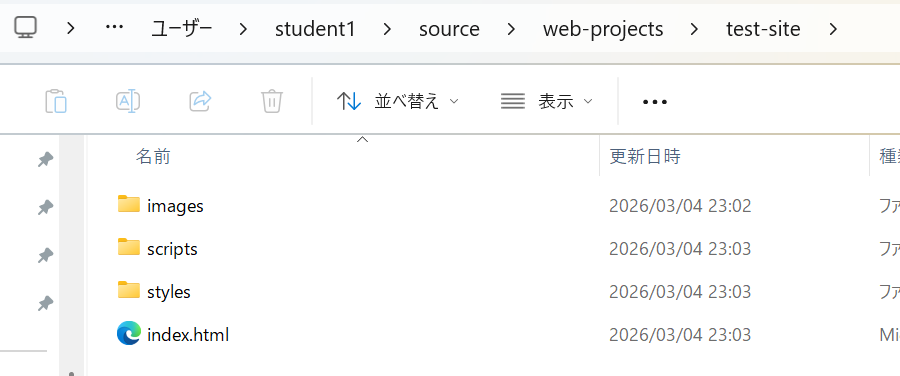

<ruby>次<rt>つぎ</rt></ruby>は、Windowsを<ruby>使<rt>つか</rt></ruby>っている<ruby>人<rt>ひと</rt></ruby>が<ruby>最初<rt>さいしょ</rt></ruby>に<ruby>行<rt>おこな</rt></ruby>うべき<ruby>設定<rt>せってい</rt></ruby>について<ruby>説明<rt>せつめい</rt></ruby>します。

***

## 5. Windowsの<ruby>設定<rt>せってい</rt></ruby>：<ruby>拡張子<rt>かくちょうし</rt></ruby>を<ruby>表示<rt>ひょうじ</rt></ruby>する

Windowsでは、ファイルの<ruby>種類<rt>しゅるい</rt></ruby>を<ruby>表<rt>あらわ</rt></ruby>す「.html」や「.jpg」などの<ruby>拡張子<rt>かくちょうし</rt></ruby>が、<ruby>既定<rt>きてい</rt></ruby>の<ruby>設定<rt>せってい</rt></ruby>では<ruby>隠<rt>かく</rt></ruby>れています。

しかし、<ruby>開発<rt>かいはつ</rt></ruby>では<ruby>拡張子<rt>かくちょうし</rt></ruby>が<ruby>重要<rt>じゅうよう</rt></ruby>です。.html ファイルなのか、<ruby>設定<rt>せってい</rt></ruby>用の .env ファイル（ドットファイル）なのかを<ruby>正<rt>ただ</rt></ruby>しく<ruby>判断<rt>はんだん</rt></ruby>するために、<ruby>必<rt>かなら</rt></ruby>ず<ruby>表示<rt>ひょうじ</rt></ruby>させてください。

<ruby>拡張子<rt>かくちょうし</rt></ruby>を<ruby>表示<rt>ひょうじ</rt></ruby>する<ruby>手順<rt>てじゅん</rt></ruby>

1. フォルダ（エクスプローラー）を<ruby>開<rt>ひら</rt></ruby>きます。
2. <ruby>上<rt>うえ</rt></ruby>にある [<ruby>表示<rt>ひょうじ</rt></ruby>] タブ、または [...] メニューから [オプション] を<ruby>選<rt>えら</rt></ruby>びます。
3. [<ruby>表示<rt>ひょうじ</rt></ruby>] タブをクリックします。
4. <ruby>詳細<rt>しょうさい</rt></ruby><ruby>設定<rt>せってい</rt></ruby>の<ruby>中<rt>なか</rt></ruby>にある [<ruby>登録<rt>とうろく</rt></ruby>されている<ruby>拡張子<rt>かくちょうし</rt></ruby>は<ruby>表示<rt>ひょうじ</rt></ruby>しない] のチェックを<ruby>外<rt>はず</rt></ruby>します。
5. [OK] をクリックします。

<ruby>最後<rt>さいご</rt></ruby>に、ファイル<ruby>同士<rt>どうし</rt></ruby>をつなぐ「ファイルパス」について<ruby>説明<rt>せつめい</rt></ruby>します。

***

## 6. ファイルパス：ファイル<ruby>同士<rt>どうし</rt></ruby>をつなぐ<ruby>道<rt>みち</rt></ruby>

「ファイルパス」は、あるファイルから<ruby>別<rt>べつ</rt></ruby>のファイルを<ruby>探<rt>さが</rt></ruby>しにいくための「<ruby>道<rt>みち</rt></ruby>」のことです。

<ruby>書<rt>か</rt></ruby>き<ruby>方<rt>かた</rt></ruby>のパターン

* <ruby>同<rt>おな</rt></ruby>じ<ruby>場所<rt>ばしょ</rt></ruby>にあるとき index.html から<ruby>同<rt>おな</rt></ruby>じフォルダのファイルを見る<ruby>場合<rt>ばあい</rt></ruby>。  <ruby>例<rt>れい</rt></ruby>：filename.jpg
* <ruby>下<rt>した</rt></ruby>のフォルダにあるとき index.html から images フォルダの<ruby>中<rt>なか</rt></ruby>のファイルを見る<ruby>場合<rt>ばあい</rt></ruby>。  <ruby>例<rt>れい</rt></ruby>：images/filename.jpg
* <ruby>一<rt>ひと</rt></ruby>つ<ruby>上<rt>うえ</rt></ruby>のフォルダにあるとき styles フォルダの<ruby>中<rt>なか</rt></ruby>のCSSから、<ruby>外<rt>そと</rt></ruby>にある images フォルダの<ruby>中<rt>なか</rt></ruby>のファイルを見る<ruby>場合<rt>ばあい</rt></ruby>。  <ruby>例<rt>れい</rt></ruby>：../images/filename.jpg（.. は「<ruby>一<rt>ひと</rt></ruby>つ<ruby>上<rt>うえ</rt></ruby>の<ruby>階層<rt>かいそう</rt></ruby>へ<ruby>行<rt>い</rt></ruby>く」という<ruby>意味<rt>いみ</rt></ruby>です）

**<ruby>大切<rt>たいせつ</rt></ruby>な<ruby>注意点<rt>ちゅういてん</rt></ruby>**

Windowsではフォルダの<ruby>区切<rt>くぎ</rt></ruby>りに「\（バックスラッシュ）」を<ruby>使<rt>つか</rt></ruby>いますが、ウェブ<ruby>開発<rt>かいはつ</rt></ruby>では**<ruby>必<rt>かなら</rt></ruby>ず「/（スラッシュ）」**を<ruby>使<rt>つか</rt></ruby>ってください。\ を<ruby>使<rt>つか</rt></ruby>うと、<ruby>自分<rt>じぶん</rt></ruby>のパソコンでは<ruby>動<rt>うご</rt></ruby>いても、インターネットに<ruby>公開<rt>こうかい</rt></ruby>した<ruby>瞬間<rt>しゅんかん</rt></ruby>にウェブサイトが<ruby>壊<rt>こわ</rt></ruby>れてしまいます。

***

## まとめ

* <ruby>整理整頓<rt>せいりせいとん</rt></ruby>：web-projects フォルダを<ruby>作<rt>つく</rt></ruby>り、<ruby>中身<rt>なかみ</rt></ruby>をミラー<ruby>構造<rt>こうぞう</rt></ruby>で<ruby>整理<rt>せいり</rt></ruby>しましょう。
* <ruby>名前<rt>なまえ</rt></ruby>のルール：<ruby>小文字<rt>こもじ</rt></ruby>、スペースなし、ハイフンを<ruby>使<rt>つか</rt></ruby>いましょう。
* パスの<ruby>指定<rt>してい</rt></ruby>：ウェブでは<ruby>必<rt>かなら</rt></ruby>ず「/（スラッシュ）」を<ruby>使<rt>つか</rt></ruby>いましょう。

ルールを<ruby>守<rt>まも</rt></ruby>ってフォルダを<ruby>作<rt>つく</rt></ruby>れば、あとの<ruby>作業<rt>さぎょう</rt></ruby>がとても<ruby>楽<rt>らく</rt></ruby>になります。<ruby>一歩<rt>いっぽ</rt></ruby>ずつ、<ruby>楽<rt>たの</rt></ruby>しくウェブサイトを<ruby>作<rt>つく</rt></ruby>っていきましょう。<ruby>応援<rt>おうえん</rt></ruby>しています！