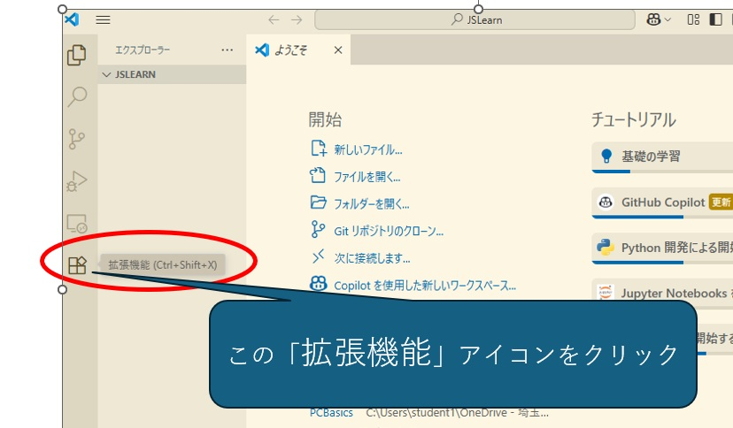
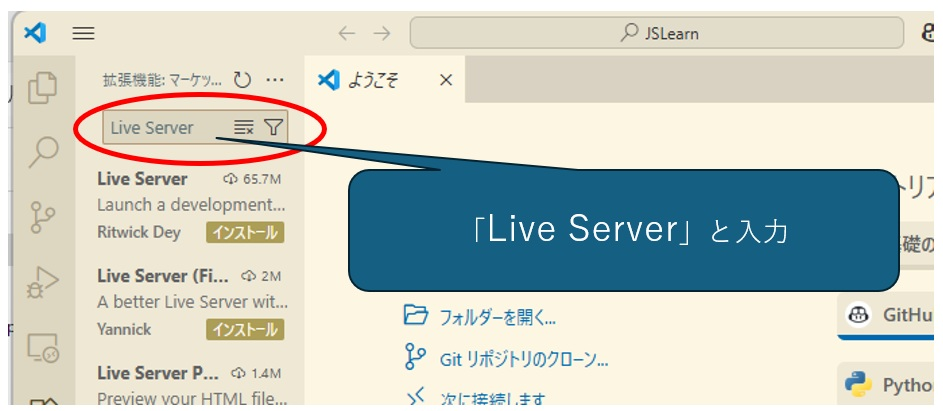
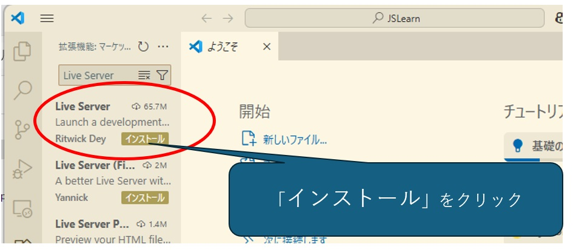
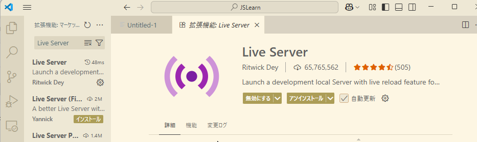
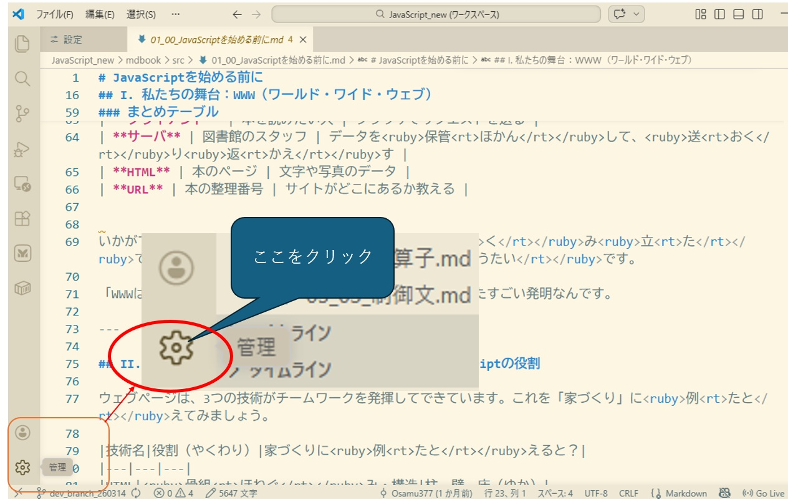
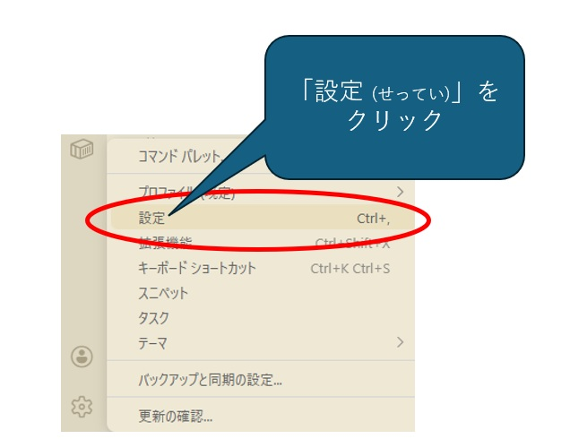
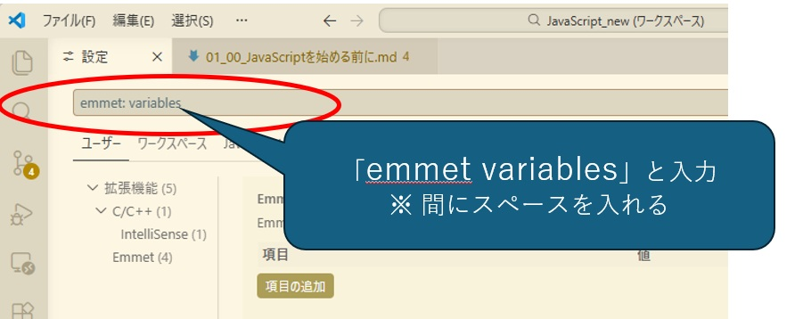
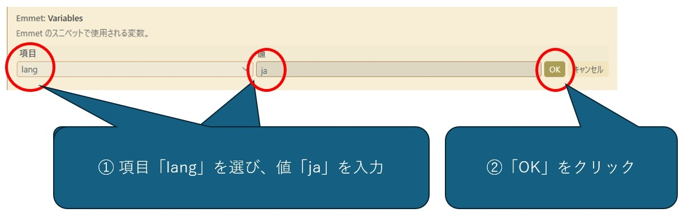

# Visual Studio Code の<ruby>準備<rt>じゅんび</rt></ruby>

## 起動方法

## Live Server<ruby>拡張機能<rt>かくちょうきのう</rt></ruby>の<ruby>インストール<rt>いんすとーる</rt></ruby>

1.  <ruby>拡張機能<rt>かくちょうきのう</rt></ruby>アイコンをクリックします

2.  <ruby>検索<rt>けんさく</rt></ruby>ウィンドウに"Live Server"と<ruby>入力<rt>にゅうりょく</rt></ruby>します

3.  "インストール"をクリックします

  

4.  インストールされたことを<ruby>確認<rt>かくにん</rt></ruby>します

***

## <ruby>言語<rt>げんご</rt></ruby><ruby>設定<rt>せってい</rt></ruby>

1. <ruby>左下隅<rt>ひだりしたすみ</rt></ruby>の<ruby>歯車<rt>はぐるま</rt></ruby>アイコンをクリック

1. 「<ruby>設定<rt>せってい</rt></ruby>」をクリック

1. <ruby>検索<rt>けんさく</rt></ruby><ruby>窓<rt>まど</rt></ruby>に「emmet variables」と<ruby>入力<rt>にゅうりょく</rt></ruby>  

1. <ruby>項目<rt>こうもく</rt></ruby>「lang」に「ja」を<ruby>指定<rt>してい</rt></ruby>して「OK」をクリック  

***

## キーの<ruby>働き<rt>はたらき</rt></ruby>

| キー           | <ruby>働き<rt>はたらき</rt></ruby>                                                                                     |
| ------------ | ---------------------------------------------------------------------------------------------------------------- |
| →            | <ruby>右<rt>みぎ</rt></ruby>へ                                                                                       |
| ←            | <ruby>左<rt>ひだり</rt></ruby>へ                                                                                      |
| ↓            | <ruby>下<rt>した</rt></ruby>へ                                                                                       |
| ↑            | <ruby>上<rt>うえ</rt></ruby>へ                                                                                       |
| Shift+→      | <ruby>選択<rt>せんたく</rt></ruby><ruby>範囲<rt>はんい</rt></ruby>を<ruby>右<rt>みぎ</rt></ruby>へ<ruby>広げる<rt>ひろげる</rt></ruby>  |
| Shift+←      | <ruby>選択<rt>せんたく</rt></ruby><ruby>範囲<rt>はんい</rt></ruby>を<ruby>左<rt>ひだり</rt></ruby>へ<ruby>広げる<rt>ひろげる</rt></ruby> |
| Shift+↓      | <ruby>選択<rt>せんたく</rt></ruby><ruby>範囲<rt>はんい</rt></ruby>を<ruby>下<rt>した</rt></ruby>へ<ruby>広げる<rt>ひろげる</rt></ruby>  |
| Shift+↑      | <ruby>選択<rt>せんたく</rt></ruby><ruby>範囲<rt>はんい</rt></ruby>を<ruby>上<rt>うえ</rt></ruby>へ<ruby>広げる<rt>ひろげる</rt></ruby>  |
| Ctrl+C       | コピー                                                                                                              |
| Ctrl+X       | <ruby>切り取り<rt>きりとり</rt></ruby>                                                                                   |
| Ctrl+V       | <ruby>貼り付け<rt>はりつけ</rt></ruby>                                                                                   |
| Ctrl+F       | <ruby>検索<rt>けんさく</rt></ruby>                                                                                     |
| CTrl+H       | <ruby>置換<rt>ちかん</rt></ruby>                                                                                      |
| Ctrl+N       | <ruby>新規<rt>しんき</rt></ruby>ファイル                                                                                  |
| Ctrl+O       | ファイルを<ruby>開く<rt>ひらく</rt></ruby>                                                                                 |
| Ctrl+S       | <ruby>保存<rt>ほぞん</rt></ruby>                                                                                      |
| Ctrl+Shift+S | <ruby>名前<rt>なまえ</rt></ruby>を<ruby>付けて<rt>つけて</rt></ruby><ruby>保存<rt>ほぞん</rt></ruby>                              |
