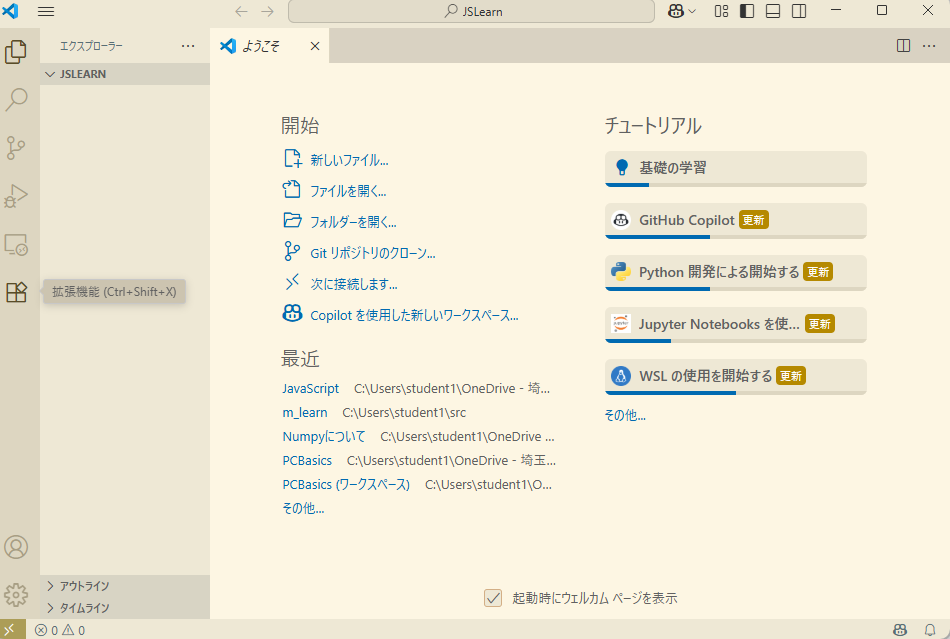
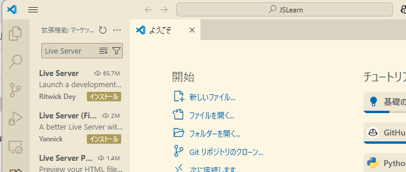
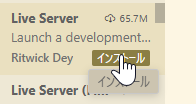
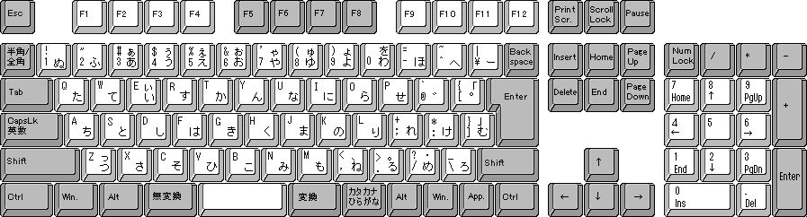

# Visual Studio Code の準備

## Live Server拡張機能のインストール

1. 拡張機能アイコンをクリックします

1. 検索ウィンドウに"Live Server"と入力します

1. "インストール"をクリックします

1. インストールされたことを確認します

---

## 日本語キーボード

# キーの働き

|キー|働き|
|---|---|
|→|右へ|
|←|左へ|
|↓|下へ|
|↑|上へ|
|Shift+→|選択範囲を右へ広げる|
|Shift←|選択範囲を左へ広げる|
|Shift↓|選択範囲を下へ広げる|
|Shift↑|選択範囲を上へ広げる|
|Ctrl+C|コピー|
|Ctrl+X|切り取り|
|Ctrl+V|貼り付け|
|Ctrl+F|検索|
|CTrl+H|置換|
|Ctrl+N|新規ファイル|
|Ctrl+O|ファイルを開く |
|Ctrl+S|保存|
|Ctrl+Shift+S|名前を付けて保存|
